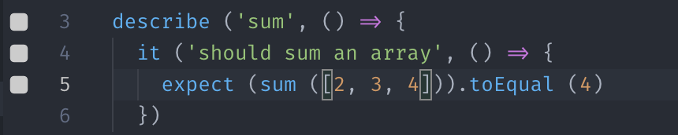

## A sample wallaby project

### Tool used
The editor used is VSCode in it's version 1.30.1
As for the tool used in the process here he's a snapshot of the relevant part of package.json:

```
  "devDependencies": {
    "@types/jest": "^23.3.10",
    "@types/node": "^10.12.18",
    "husky": "^1.2.1",
    "jest": "^23.6.0",
    "lint-staged": "^8.1.0",
    "ts-jest": "^23.10.5",
    "ts-node": "^7.0.1",
    "tslint": "^5.12.0",
    "tslint-eslint-rules": "^5.4.0",
    "typescript": "^3.2.2"
  }
```

### Configuration
Here is the content of teh `wallaby.conf.js`:
```
module.exports = w => ({
  files: ['src/**/*.ts'],
  tests: ['src/**/*.test.ts'],
  compilers: {
    '**/*.ts?(x)': w.compilers.typeScript({isolatedModules: true})
  },
})
```

I've taken the bases from [the doc page dedicated to Typescript](https://wallabyjs.com/docs/integration/typescript.html), and added as well the isolated modules as [specified here](https://wallabyjs.com/docs/integration/typescript.html#isolated-modules) since i'm using `typescript` `jest` and `ts-jest`

### Issue description

When I start wallaby (after selecting configuration file for good measure), something break.
I got the following `vscode console output` for `wallaby`:

```
​​Error: Missing tracer start subscription​​
​​at http://localhost:63594/__wallaby__/tracer.js:14​​
​​Error: Missing tracer start subscription
```

And as well contrarely to the demo project the square are neither green not red but white:


Any ideas on what went wrong?